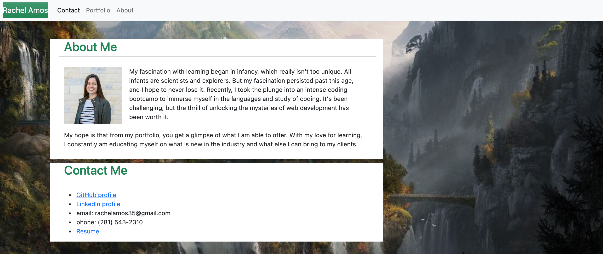
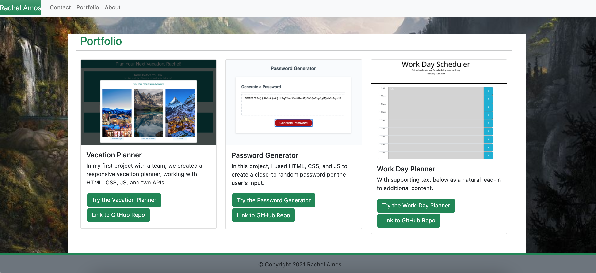

# Rachel Amos: Portfolio

Full Stack Web Developer with a background in writing, project management, and logistics.
Passionate learner and effective communicator with a knack for pushing projects to completion.
Reputation for upbeat personality and always being a team player.

Technologies:
- HTML5, CSS3, JavaScript ES6+, Bootstrap, jQuery

In my portfolio:
1. Vacation Planner - HTML, CSS, JS, Bulma, Open Weather API, and Zomato API
2. WeekDaze - HTML, CSS, JS, Chart.js, 
2. Password Generator - HTML, CSS, JS, Bootstrap
3. Work Day Planner - HTML, CSS, JS, jQuery, Bootstrap, Moment.js

[Link to Application](https://rachelamos.github.io/portfolio/)

---

## Contributers

- Rachel Amos

## License & copyright

© Rachel Amos
Licensed under the [MIT License](LICENSE).